# Stack for dev redises running on ec2

<h4>Overview</h4>



Run whenever there is a change in CDK

```
npm run build
```

Bootstrap cdk resource in AWS

```
cdk bootstrap aws://AWS_ACCOUNT_ID/REGION
```

Deploy BBF-DEV-EC2 stack

```
cdk deploy
```

Destroy BBF-DEV-EC2 resources running on AWS

```
cdk destroy
```
